### Step 1. Clone repository
Go to the relevant repo page on GitHub and click on the "Clone or download" button.

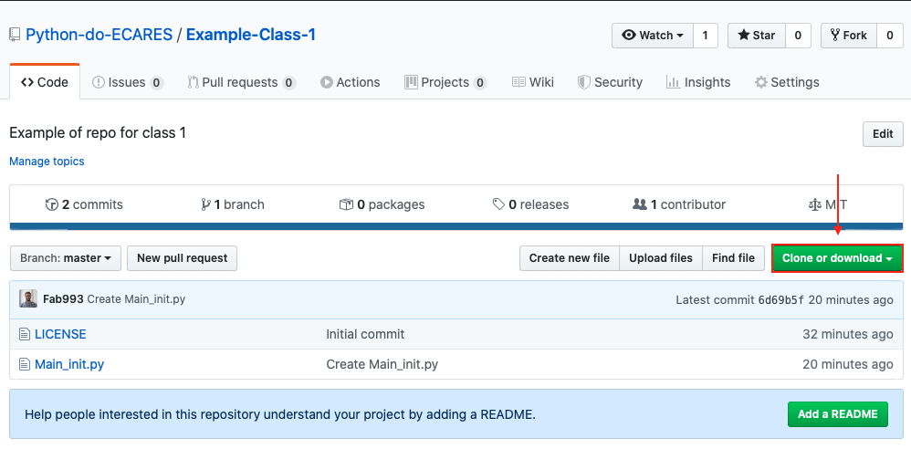

Choose "Open in Desktop".

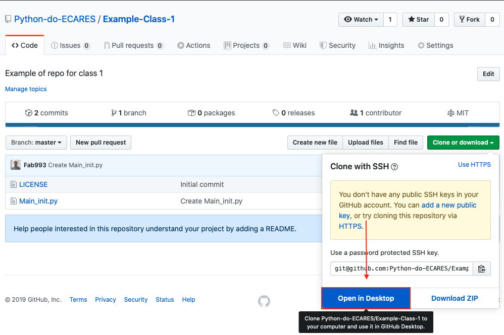

This will open a window in your GitHub Desktop environment. Check the local path where to clone the repo and click "Clone".

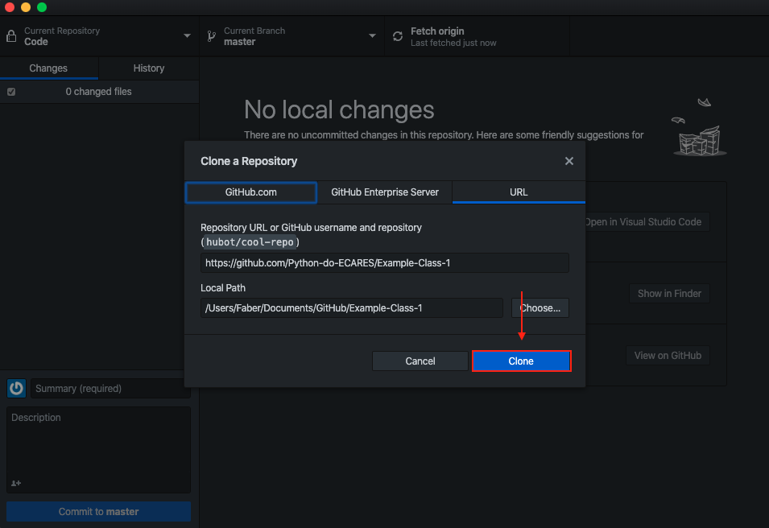

### Step 2. Make Changes
Open the file "Main_init.py" in your favourite compiler (e.g. VS Code). Add a comment line with your name.

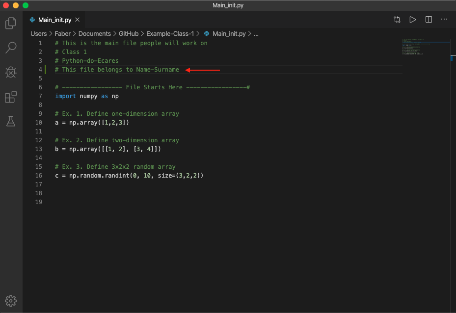

Save the file. Changes will be displayed in GitHub Desktop as follows.

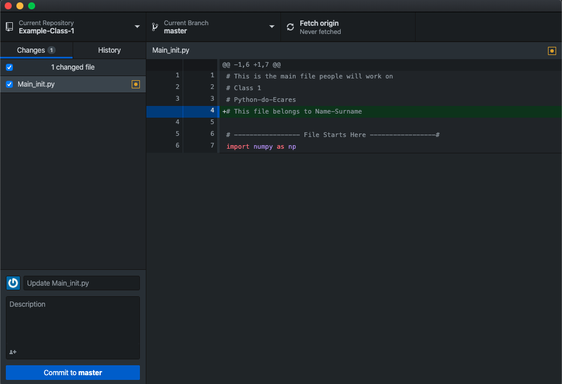

### Step 3. Create Your Own Branch And Commit Changes
Click on "Master" in the top panel. Then click on "New Branch". **Never directly commit your changes to the Master**.

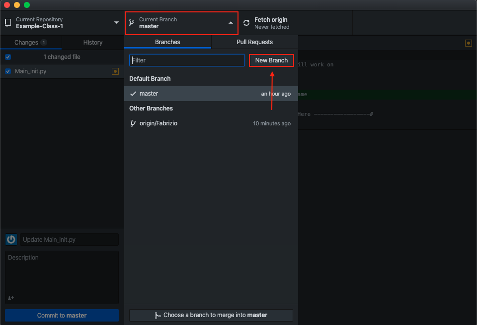

Give the new branch your name. Then click "Create Branch".

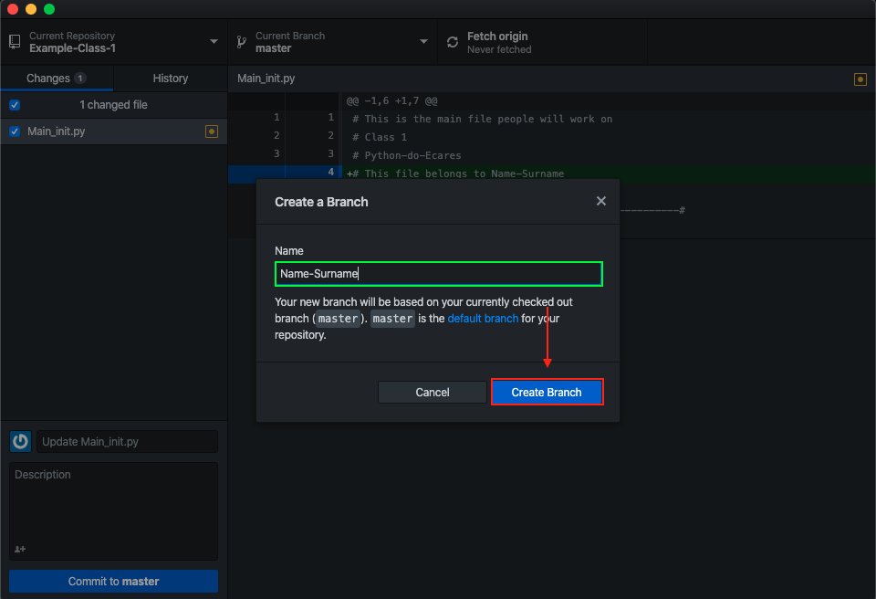

Switch changes to your own branch. 

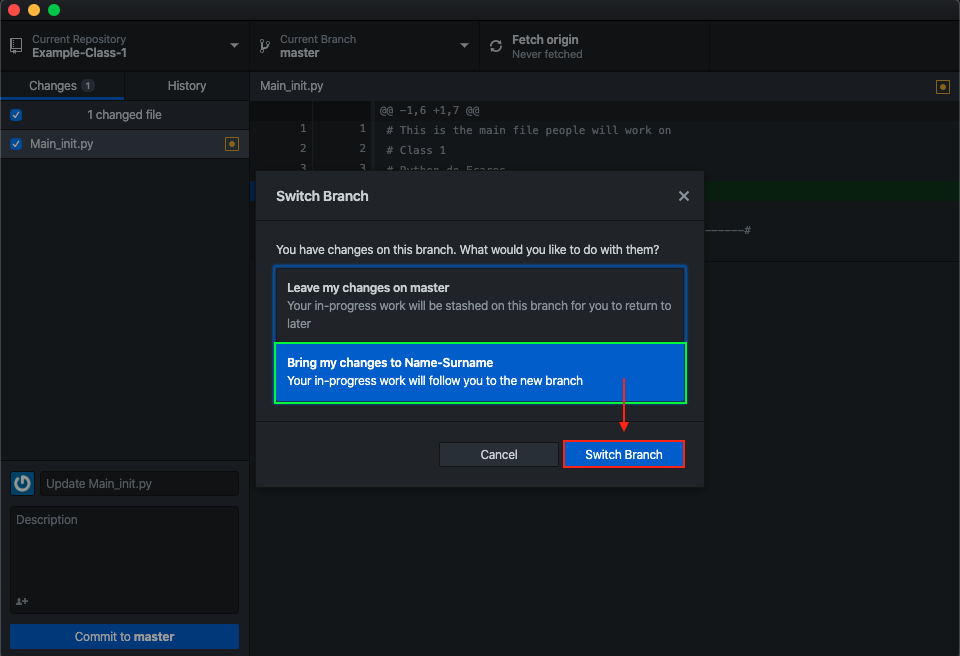

Publish your branch online.

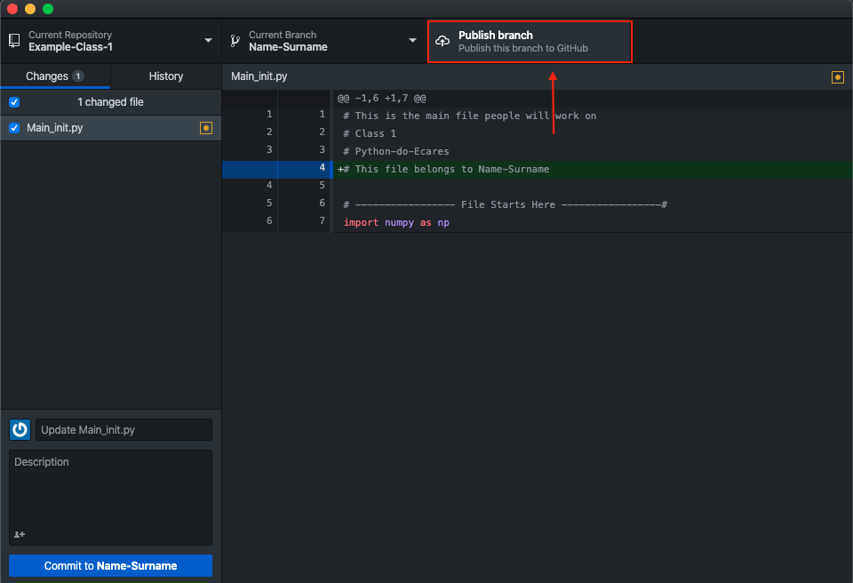

Commit changes to your branch. 

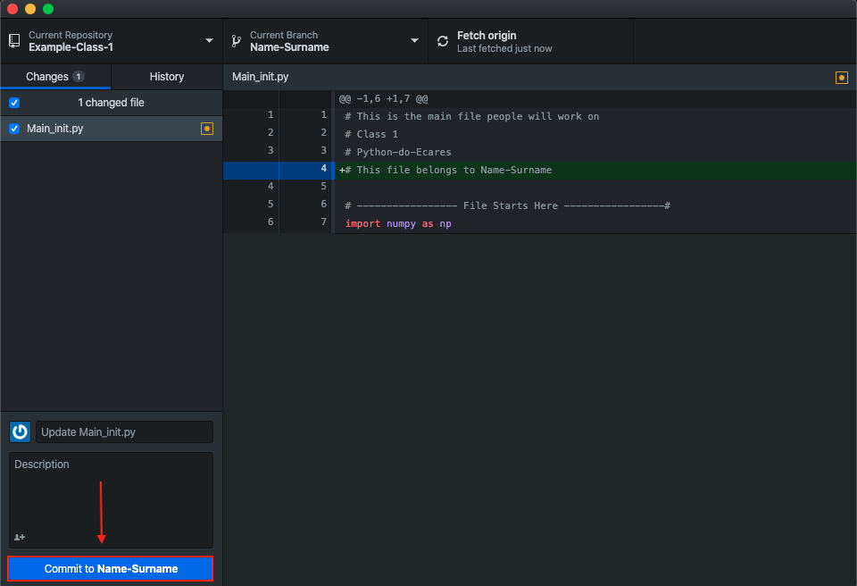

Push changes to your branch.

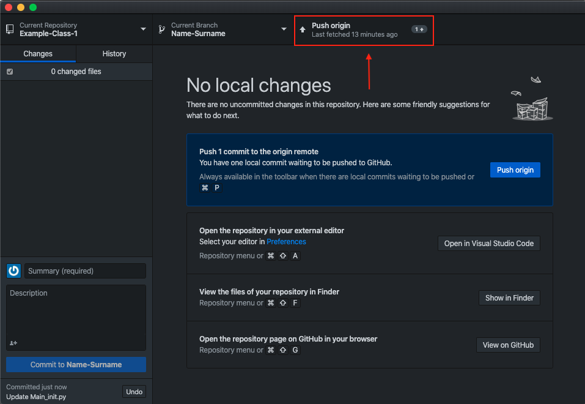

Your directory will now appear under the repo GitHub webpage as follows.

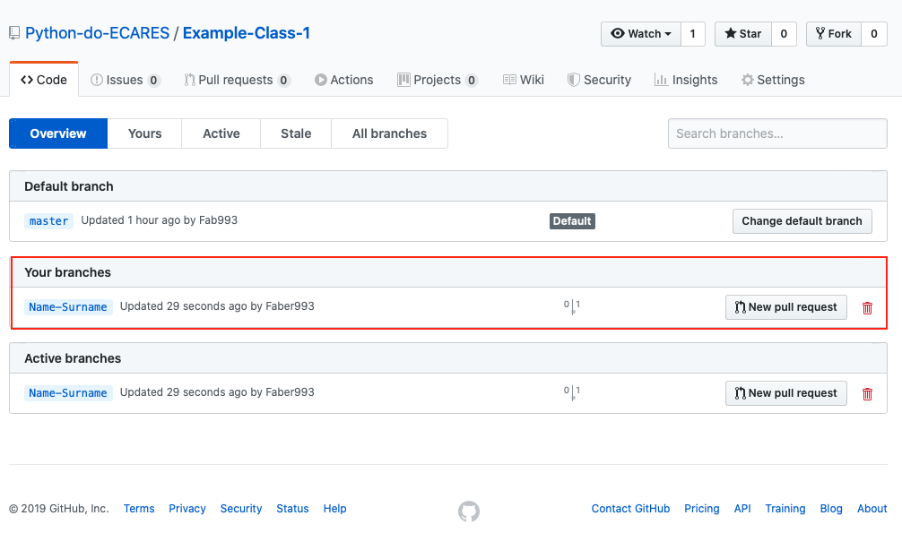

### Step 4. Next Steps
From now on, you can commit your chanes to your own branch anytime you want. You can also navigate to other people branches and see what they are up to. **Do not commit to their branches directly**. Instead, you can open a pull request to collaborate.

## When and How to Commit and Push
There is a substantial difference between the "commit" and "push" command. Committing changes to a branch, means that you are "saving" your changes. Pushing changes means, instead, that you are publishing them online on GitHub. With this respect, we recomment to commit changes regurlarly (you can always revert them back), but to only push them online if you have made a stable change. Think of the pushing action as a way of creating different stable releases of your code. When committing chages in GitHub Desktop, it is possible to give a summary and a brief description of the change. We encourage you to adopt the following standard.

- **Summary** should be either **Minor Change**, **Major Change** or **Bug Fixes**. The first should indicate small changes in syntaxis or general improvements. The second to major modifications (e.g. add new section or function), while the third is to notify that you have fixed some bug.

- **Description** should briefly explain what the summary refers to. 

Suppose you create a new function for data cleaning in your code. When pushing this change to GitHub, you want to give **Major Change** as summary and "added function for data cleaning" as description.

Consistently follow these rules will make you (hopefully) remember what you did if you will look again at your code after a period of inactivity. A tidy pushing activities will create a full history of changes in GitHub that you can scroll through to check different versions of your code. Finally, it will also help other people to understand your work. 

